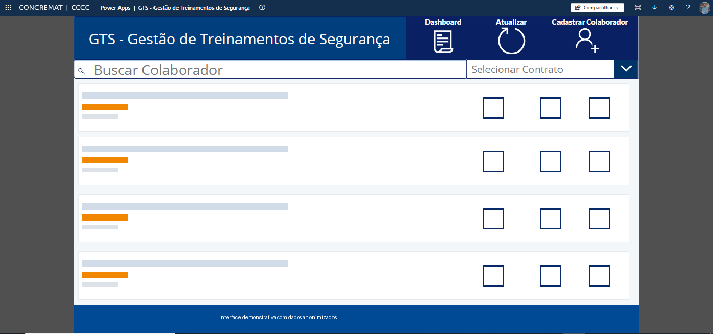

# GTS | Gestão de Treinamentos de Segurança



O **GTS, Gestão de Treinamentos de Segurança**, é um ecossistema integrado para acompanhamento, gestão, cadastro e atualização dos estados de treinamentos dos colaboradores da Unidade de Negócio Indústria & Mineração.

A solução conecta listas do SharePoint, Power Apps, fluxos do Power Automate, uma matriz de treinamentos em Excel e uma aplicação web em HTML. O resultado é um processo mais simples de operar, mais previsível e menos sujeito a falhas no acompanhamento de vencimentos.

> A solução está em operação há mais de seis meses e recebe melhorias contínuas com base no uso real e nas necessidades dos responsáveis pelos contratos.

## Visão geral

O GTS foi estruturado para combinar operação, automação e análise:

```text
Responsáveis pelos contratos
            |
            v
Power Apps GTS
            |
            +-----------------------------+
            |                             |
            v                             v
Lista GTS                         Lista GTS Pivotado
cadastro do colaborador           histórico por treinamento
            |                             |
            +--------------+--------------+
                           |
                           v
                 Power Automate
          alertas diários de vencimento
                           |
                           v
                   Outlook / e-mail

Matriz de Treinamentos.xlsx
consultas, matriz e tabelas auxiliares
                           |
                           v
                Dashboard web index.html
       auditoria, conformidade e relatórios
```

## Objetivo

Centralizar e tornar operacional a gestão de treinamentos obrigatórios, realizados, pendentes e próximos do vencimento. A solução permite que cada responsável acompanhe seu contrato, atualize registros, cadastre colaboradores, consulte situações e tome providências antes do vencimento de uma capacitação.

## Componentes do ecossistema

### 1. Lista GTS no SharePoint

Base orientada ao cadastro e à edição das informações principais dos colaboradores. Reúne atributos como contrato ou centro de custo, nome, cargo, situação, dados de contato e demais campos necessários para a operação do aplicativo.

### 2. Lista GTS Pivotado no SharePoint

Base despivotada, com granularidade por colaborador e treinamento. Essa estrutura permite editar cada capacitação individualmente e registrar realização, vencimento, situação e demais informações necessárias ao acompanhamento.

> Os nomes históricos das listas podem sugerir o sentido contrário. Nesta documentação, a distinção funcional prevalece: uma base representa o cadastro do colaborador e a outra representa registros individualizados de treinamentos.

### 3. Power Apps GTS

O Power Apps é a interface operacional utilizada pelos responsáveis de cada contrato. A aplicação oferece pesquisa de colaboradores, filtro por contrato, consulta da situação, atualização de dados, inclusão de novos treinamentos e cadastro de colaboradores.

O botão **Dashboard** encaminha o usuário para a aplicação web disponibilizada online, conectando a operação diária à camada analítica.

### 4. Power Automate

Fluxos automáticos percorrem as bases diariamente e enviam lembretes de treinamentos próximos do vencimento aos responsáveis. Essa automação transforma o controle de validade em um processo proativo, reduzindo a dependência de consultas manuais.

### 5. Matriz de Treinamentos.xlsx

A planilha de apoio documenta e organiza a estrutura do ecossistema. Entre os elementos utilizados estão:

- matriz de obrigatoriedade por cargo ou função;
- informações transpostas de treinamentos;
- lista suspensa para validação no Power Apps;
- consultas conectadas às listas do SharePoint;
- tabelas auxiliares consumidas pela aplicação web;
- duração, modalidade, local e validade dos treinamentos.

A planilha operacional não faz parte da distribuição pública desta branch porque as consultas podem materializar dados pessoais e registros internos. O repositório mantém apenas a documentação do seu papel arquitetural.

### 6. Aplicação web `index.html`

O arquivo [`index.html`](index.html) é a camada de análise e auditoria do GTS. A aplicação importa o arquivo principal e bases complementares, processa os dados no navegador e entrega uma visão consolidada sem exigir backend próprio.

## Recursos da aplicação web

- importação do arquivo principal de treinamentos;
- importação simultânea de bases complementares;
- detecção automática de tabelas por nomes e cabeçalhos;
- importação por pasta quando suportada pelo navegador;
- painel gerencial com KPIs de conformidade e vencimento;
- treinamentos internos e externos;
- visão unificada;
- pesquisa por treinamento;
- consulta consolidada por colaborador;
- visão por contrato ou centro de custo;
- auditoria individual;
- alertas por faixas de vencimento;
- análise de conformidade com a matriz de obrigatoriedade;
- correspondência aproximada entre nomes de treinamentos;
- geração e download de relatórios Excel;
- preparação de avisos por e-mail por meio do cliente padrão, incluindo Outlook quando configurado;
- impressão de visões para apoio à fiscalização e auditoria.

## Jornada do usuário

1. O responsável acessa o Power Apps GTS.
2. O responsável pesquisa ou filtra o contrato.
3. O responsável cadastra ou atualiza colaboradores e treinamentos.
4. Os fluxos de Power Automate verificam vencimentos diariamente.
5. Os responsáveis recebem os lembretes automáticos.
6. Ao selecionar **Dashboard**, o usuário acessa a aplicação HTML hospedada online.
7. O usuário importa `Matriz de Treinamentos.xlsx` e as bases complementares autorizadas.
8. O navegador consolida os dados e apresenta indicadores, auditorias e relatórios.

## Arquitetura técnica

```text
Microsoft SharePoint
  |-- cadastro de colaboradores
  `-- registros individualizados de treinamentos
             |
             +--> Microsoft Power Apps
             |      operação e manutenção
             |
             +--> Microsoft Power Automate
             |      alertas recorrentes
             |             |
             |             `--> Microsoft Outlook
             |
             `--> Microsoft Excel
                    consultas e matriz
                           |
                           v
GitHub --> Cloudflare --> index.html
                           |
                           v
                     navegador do usuário
              importação, análise e exportação
```

## Tecnologias

- Microsoft SharePoint
- Microsoft Power Apps
- Microsoft Power Automate
- Microsoft Outlook
- Microsoft Excel e Power Query
- HTML5
- CSS3
- JavaScript
- SheetJS / XLSX
- GitHub
- Cloudflare

## Como executar o dashboard

1. Baixe os arquivos desta branch.
2. Abra [`index.html`](index.html) em um navegador moderno.
3. Importe somente arquivos autorizados.
4. Utilize os filtros, indicadores, alertas, auditorias e relatórios.

Para servir localmente:

```powershell
python -m http.server 8000
```

Acesse:

```text
http://localhost:8000/index.html
```

## Dependências externas

A versão atual de `index.html` carrega a biblioteca XLSX 0.18.5 por CDN e importa fontes do Google. A aplicação pode precisar de acesso à internet para carregar esses recursos. Uma evolução recomendada é disponibilizar essas dependências localmente para uma experiência totalmente offline.

## Impacto operacional

Antes do GTS, o acompanhamento de vencimentos dependia de controles mais fragmentados e de verificações manuais. A arquitetura integrada introduziu:

- visão centralizada dos registros;
- responsabilidade por contrato;
- alertas recorrentes;
- análise antecipada de vencimentos;
- redução de retrabalho;
- maior previsibilidade;
- relatórios voltados à auditoria;
- evolução contínua baseada no uso real.

A principal transformação foi deslocar a gestão de um modelo reativo para um modelo preventivo, no qual os responsáveis recebem sinais antes do vencimento e dispõem de uma visão consolidada para agir.

## Privacidade e publicação

Este repositório não deve conter exportações reais das listas nem a planilha operacional com consultas atualizadas. Esses arquivos podem incluir dados pessoais, contatos, identificadores profissionais e informações internas.

- use somente dados sintéticos ou anonimizados em demonstrações;
- não publique exportações do SharePoint;
- não publique CPFs, telefones, e-mails, matrículas ou nomes reais;
- revise capturas de tela antes do commit;
- mantenha os controles de acesso no Power Apps e no SharePoint;
- trate o dashboard web como camada analítica, não como mecanismo de autorização;
- revise relatórios gerados antes de compartilhá-los;
- respeite as políticas internas e a legislação aplicável.

A imagem `GTS.png` incluída nesta branch foi preparada para apresentação pública com ocultação dos registros exibidos na lista.

## Uso de inteligência artificial

A IA generativa foi utilizada para acelerar prototipação, ajustes de interface, evolução de funcionalidades e documentação. A arquitetura, as regras de negócio, os indicadores, os fluxos de trabalho, os testes e a validação permaneceram sob responsabilidade humana.

## Estrutura da branch

Todos os arquivos ficam na mesma pasta:

```text
README.md
ARCHITECTURE.md
NOTICE.md
SECURITY.md
.gitignore
index.html
GTS.png
```

## Escopo do repositório

Esta branch apresenta a arquitetura e a aplicação web do GTS como projeto de portfólio. As listas do SharePoint, o pacote do Power Apps, os fluxos do Power Automate e as bases operacionais permanecem nos ambientes corporativos autorizados.

## Autor

**Gustavo Freitas Gomes Dumont**
